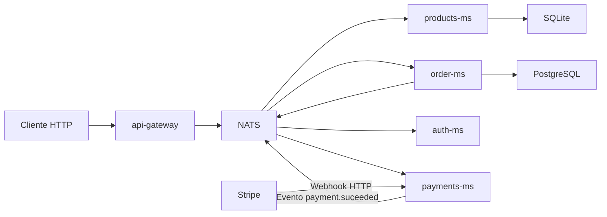
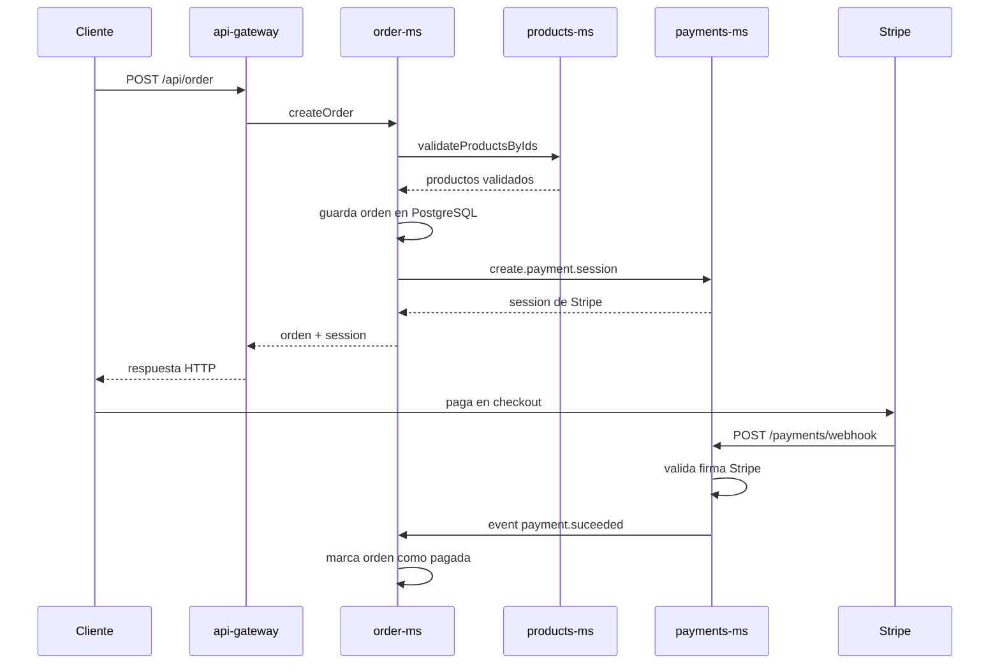

# Products Launcher

Launcher y entorno de desarrollo para una arquitectura de microservicios construida con NestJS. Este repositorio no concentra toda la lógica en un solo backend: coordina varios servicios especializados, los conecta por NATS y permite levantar el sistema completo con Docker Compose.

La meta de este README es que alguien sin contacto previo con el proyecto pueda entender:

1. qué resuelve el sistema;
2. cómo se divide en microservicios;
3. cómo viaja una petición entre servicios;
4. cómo levantarlo localmente;
5. por dónde conviene leer el código.

## Qué hace este proyecto

El sistema modela una plataforma simple de e-commerce interno:

- `api-gateway` recibe las peticiones HTTP.
- `products-ms` administra el catálogo de productos.
- `order-ms` crea y consulta órdenes.
- `payments-ms` crea sesiones de pago con Stripe y procesa webhooks.
- `auth-ms` expone un flujo de autenticación mock para demos y pruebas de integración.
- `nats-server` conecta a los servicios mediante mensajería.

## Cómo entender este proyecto si vienes de cero

Si es tu primera vez viendo este repo, este es el mejor orden de lectura:

1. Lee [`docker-compose.yml`](/Users/cfs-andres/Workspace/Cursos/Nest+Microservicios/03-Products-Launcher/docker-compose.yml) para ver qué servicios existen, qué puertos usan y cómo se conectan.
2. Revisa este README completo para entender arquitectura, flujos y variables.
3. Entra a [`api-gateway`](/Users/cfs-andres/Workspace/Cursos/Nest+Microservicios/03-Products-Launcher/api-gateway/README.md) para ver los endpoints HTTP que usa un cliente.
4. Sigue con [`products-ms`](/Users/cfs-andres/Workspace/Cursos/Nest+Microservicios/03-Products-Launcher/products-ms/README.md), porque es el dominio más simple y te ayuda a entender el patrón de comunicación por NATS.
5. Después revisa [`order-ms`](/Users/cfs-andres/Workspace/Cursos/Nest+Microservicios/03-Products-Launcher/order-ms/README.md), donde aparece el flujo más interesante: validación de productos, persistencia y preparación del pago.
6. Luego ve [`payments-ms`](/Users/cfs-andres/Workspace/Cursos/Nest+Microservicios/03-Products-Launcher/payments-ms/README.md) para entender la integración con Stripe y el webhook.
7. Deja [`auth-ms`](/Users/cfs-andres/Workspace/Cursos/Nest+Microservicios/03-Products-Launcher/auth-ms/README.md) para el final: hoy es un servicio mock útil para pruebas, no una implementación productiva.

## Arquitectura en una mirada

| Servicio | Rol | Expone | Persistencia | Puerto local |
| --- | --- | --- | --- | --- |
| `api-gateway` | Entrada HTTP del sistema | REST + Swagger | No | `${CLIENT_PORT}` -> `3000` |
| `products-ms` | Catálogo de productos | NATS | SQLite + Prisma | `3001` |
| `order-ms` | Órdenes y estado de pago | NATS | PostgreSQL + Prisma | `3002` |
| `payments-ms` | Checkout y webhooks Stripe | HTTP + NATS | No | `3003` |
| `auth-ms` | Registro/login/verify mock | NATS | No | `3004` |
| `nats-server` | Broker de mensajería | NATS monitoring | No | `8222` |
| `order-db` | Base de datos de órdenes | PostgreSQL | Sí | `5433` |

## Arquitectura y comunicación

El sistema usa dos estilos de comunicación:

- HTTP para el ingreso desde clientes hacia `api-gateway` y para el webhook de Stripe en `payments-ms`.
- NATS para request/response entre microservicios y para eventos asíncronos.



## Flujo crítico principal

El flujo más importante del proyecto es la creación y pago de una orden:

1. El cliente crea una orden por HTTP en `POST /api/order`.
2. `api-gateway` reenvía esa solicitud a `order-ms` por NATS con el pattern `createOrder`.
3. `order-ms` consulta a `products-ms` por NATS con `{ cmd: 'validateProductsByIds' }` para validar existencia y precio de los productos.
4. `order-ms` calcula el total, guarda la orden en PostgreSQL y crea sus ítems.
5. `order-ms` solicita a `payments-ms` una sesión de Stripe con `create.payment.session`.
6. `payments-ms` devuelve la `checkout session` y la URL de pago.
7. Cuando Stripe confirma el pago, llama al webhook `POST /payments/webhook`.
8. `payments-ms` valida la firma del webhook y emite el evento `payment.suceeded`.
9. `order-ms` consume ese evento y marca la orden como pagada.



## Contratos expuestos hoy

### HTTP del API Gateway

| Método | Ruta | Descripción |
| --- | --- | --- |
| `POST` | `/api/auth/register` | Registro mock de usuario |
| `POST` | `/api/auth/login` | Login mock |
| `GET` | `/api/auth/verify` | Verificación mock vía header `Authorization: Bearer ...` |
| `POST` | `/api/products` | Crear producto |
| `GET` | `/api/products` | Listar productos paginados |
| `GET` | `/api/products/:id` | Obtener producto |
| `PATCH` | `/api/products/:id` | Actualizar producto |
| `DELETE` | `/api/products/:id` | Soft delete de producto |
| `POST` | `/api/order` | Crear orden |
| `GET` | `/api/order` | Listar órdenes |
| `GET` | `/api/order/:id` | Obtener orden |
| `PATCH` | `/api/order/change-status/:id` | Cambiar estado manualmente |
| `POST` | `/api/order/test-pay-success` | Simular payload de pago hacia NATS |

### HTTP de pagos

| Método | Ruta | Descripción |
| --- | --- | --- |
| `POST` | `/payments/webhook` | Webhook de Stripe |
| `GET` | `/payments/success` | URL de éxito de checkout |
| `GET` | `/payments/failure` | URL de cancelación/error |

### Patterns y eventos NATS

| Tipo | Nombre | Emisor habitual | Consumidor |
| --- | --- | --- | --- |
| Request/response | `auth.register.user` | `api-gateway` | `auth-ms` |
| Request/response | `auth.login.user` | `api-gateway` | `auth-ms` |
| Request/response | `auth.verify.user` | `api-gateway` | `auth-ms` |
| Request/response | `{ cmd: 'createProduct' }` | `api-gateway` | `products-ms` |
| Request/response | `{ cmd: 'getProducts' }` | `api-gateway` | `products-ms` |
| Request/response | `{ cmd: 'getProduct' }` | `api-gateway` | `products-ms` |
| Request/response | `{ cmd: 'updateProduct' }` | `api-gateway` | `products-ms` |
| Request/response | `{ cmd: 'removeProduct' }` | `api-gateway` | `products-ms` |
| Request/response | `{ cmd: 'validateProductsByIds' }` | `order-ms` | `products-ms` |
| Request/response | `createOrder` | `api-gateway` | `order-ms` |
| Request/response | `findAllOrders` | `api-gateway` | `order-ms` |
| Request/response | `findOneOrder` | `api-gateway` | `order-ms` |
| Request/response | `changeOrderStatus` | `api-gateway` | `order-ms` |
| Request/response | `create.payment.session` | `order-ms` | `payments-ms` |
| Evento | `payment.suceeded` | `payments-ms` | `order-ms` |

## Stack técnico

- NestJS 11
- NATS como bus de mensajería
- Prisma ORM
- PostgreSQL en `order-ms`
- SQLite en `products-ms`
- Stripe Checkout + Webhooks en `payments-ms`
- Docker Compose para desarrollo local

## Requisitos

- Git
- Docker
- Docker Compose
- Node.js 20 o superior
- npm

## Variables de entorno

### Archivo raíz

Copia la plantilla:

```bash
cp .env.template .env
```

Variables mínimas:

```env
CLIENT_PORT=3010
STRIPE_SECRET_KEY=sk_test_xxx
STRIPE_ENDPOINT_SECRET=whsec_xxx
```

### Por microservicio

- `api-gateway`: `PORT`, `NATS_SERVERS`
- `products-ms`: `PORT`, `DATABASE_URL`, `NATS_SERVERS`
- `order-ms`: `PORT`, `DATABASE_URL`, `NATS_SERVERS`
- `payments-ms`: `PORT`, `STRIPE_SECRET_KEY`, `STRIPE_SUCCESS_URL`, `STRIPE_CANCEL_URL`, `STRIPE_ENDPOINT_SECRET`, `NATS_SERVERS`
- `auth-ms`: `PORT`, `NATS_SERVERS`

## Levantar el entorno completo

### 1. Clonar con submódulos

```bash
git clone <URL_DEL_REPOSITORIO>
cd 03-Products-Launcher
git submodule update --init --recursive
```

### 2. Preparar variables

```bash
cp .env.template .env
```

### 3. Construir y ejecutar

```bash
docker-compose up --build
```

Para dejarlo en background:

```bash
docker-compose up -d --build
```

## Accesos útiles

- API Gateway: `http://localhost:3010/api`
- Swagger: `http://localhost:3010/api/docs`
- NATS Monitoring: `http://localhost:8222`
- PostgreSQL órdenes: `localhost:5433`

Si cambias `CLIENT_PORT`, cambia también la URL pública del gateway.

## Flujo recomendado para desarrollar

1. Levanta el stack con Docker Compose.
2. Prueba primero Swagger en el gateway.
3. Crea productos.
4. Crea una orden usando esos `productId`.
5. Usa la sesión devuelta por Stripe para validar el flujo de pago.
6. Revisa que el webhook termine actualizando el estado de la orden.

## Qué mirar en el código

### Entrada principal

- [`api-gateway/src/main.ts`](/Users/cfs-andres/Workspace/Cursos/Nest+Microservicios/03-Products-Launcher/api-gateway/src/main.ts)
- [`api-gateway/src/auth/auth.controller.ts`](/Users/cfs-andres/Workspace/Cursos/Nest+Microservicios/03-Products-Launcher/api-gateway/src/auth/auth.controller.ts)
- [`api-gateway/src/products/products.controller.ts`](/Users/cfs-andres/Workspace/Cursos/Nest+Microservicios/03-Products-Launcher/api-gateway/src/products/products.controller.ts)
- [`api-gateway/src/order/order.controller.ts`](/Users/cfs-andres/Workspace/Cursos/Nest+Microservicios/03-Products-Launcher/api-gateway/src/order/order.controller.ts)

### Dominio de catálogo

- [`products-ms/src/products/products.controller.ts`](/Users/cfs-andres/Workspace/Cursos/Nest+Microservicios/03-Products-Launcher/products-ms/src/products/products.controller.ts)
- [`products-ms/src/products/products.service.ts`](/Users/cfs-andres/Workspace/Cursos/Nest+Microservicios/03-Products-Launcher/products-ms/src/products/products.service.ts)
- [`products-ms/prisma/schema.prisma`](/Users/cfs-andres/Workspace/Cursos/Nest+Microservicios/03-Products-Launcher/products-ms/prisma/schema.prisma)

### Dominio de órdenes

- [`order-ms/src/orders/orders.controller.ts`](/Users/cfs-andres/Workspace/Cursos/Nest+Microservicios/03-Products-Launcher/order-ms/src/orders/orders.controller.ts)
- [`order-ms/src/orders/orders.service.ts`](/Users/cfs-andres/Workspace/Cursos/Nest+Microservicios/03-Products-Launcher/order-ms/src/orders/orders.service.ts)
- [`order-ms/prisma/schema.prisma`](/Users/cfs-andres/Workspace/Cursos/Nest+Microservicios/03-Products-Launcher/order-ms/prisma/schema.prisma)

### Integración de pagos

- [`payments-ms/src/payments/payments.controller.ts`](/Users/cfs-andres/Workspace/Cursos/Nest+Microservicios/03-Products-Launcher/payments-ms/src/payments/payments.controller.ts)
- [`payments-ms/src/payments/payments.service.ts`](/Users/cfs-andres/Workspace/Cursos/Nest+Microservicios/03-Products-Launcher/payments-ms/src/payments/payments.service.ts)

## Limitaciones actuales que conviene conocer

- `auth-ms` es mock: no persiste usuarios ni emite JWT real.
- Hay nombres de subjects y respuestas NATS que todavía podrían normalizarse.
- El evento de pago se llama `payment.suceeded`; el nombre tiene un typo histórico y hoy el sistema depende de ese subject exacto.
- `products-ms` usa SQLite local, útil para desarrollo y aprendizaje, no como configuración productiva.

## Ideas útiles para evolucionarlo

- Reemplazar `auth-ms` por autenticación real con persistencia y JWT.
- Compartir DTOs/contratos entre servicios para reducir duplicación.
- Unificar manejo de errores RPC/HTTP.
- Añadir observabilidad: request IDs, logs estructurados, health checks y métricas.
- Endurecer el flujo de pagos con idempotencia de webhooks y reintentos controlados.
- Crear pruebas e2e del flujo completo orden -> pago -> orden pagada.

## Documentación adicional

- [Arquitectura](https://docs.nestjs.com/microservices/nats)
- [Stripe Webhooks](https://docs.stripe.com/webhooks/signature?lang=node)
- [Prisma Relation Queries](https://www.prisma.io/docs/v6/orm/prisma-client/queries/relation-queries)
- [docs/architecture.md](/Users/cfs-andres/Workspace/Cursos/Nest+Microservicios/03-Products-Launcher/docs/architecture.md)
- [docs/flows.md](/Users/cfs-andres/Workspace/Cursos/Nest+Microservicios/03-Products-Launcher/docs/flows.md)
- [docs/development.md](/Users/cfs-andres/Workspace/Cursos/Nest+Microservicios/03-Products-Launcher/docs/development.md)
- [docs/ideas.md](/Users/cfs-andres/Workspace/Cursos/Nest+Microservicios/03-Products-Launcher/docs/ideas.md)
- [docs/glossary.md](/Users/cfs-andres/Workspace/Cursos/Nest+Microservicios/03-Products-Launcher/docs/glossary.md)
