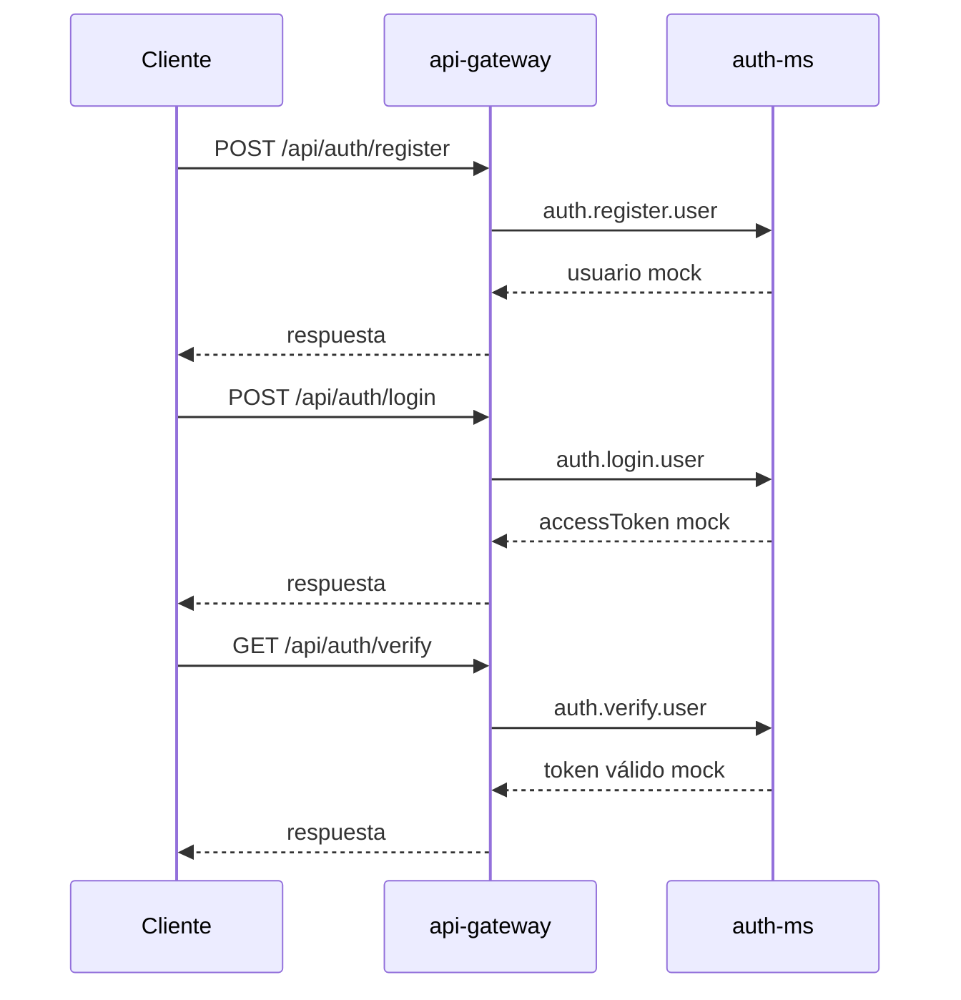
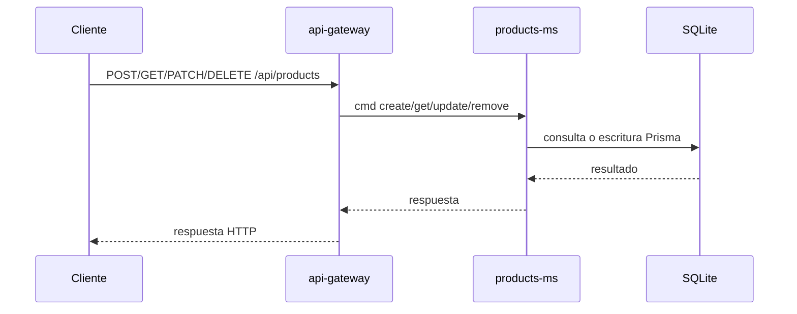
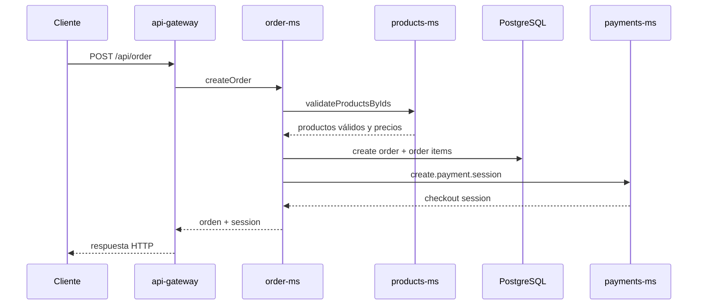
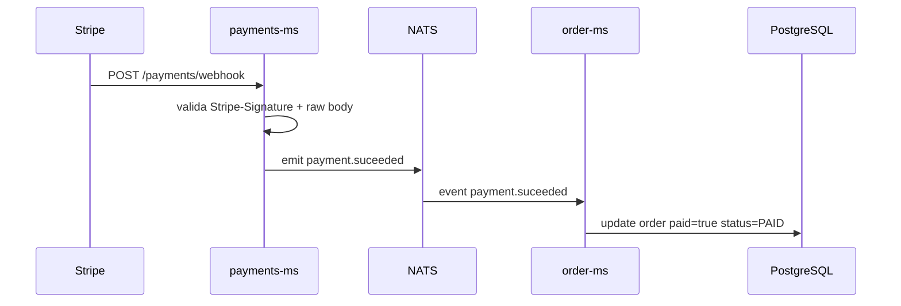

# Flujos críticos

## 1. Registro, login y verify mock

Este flujo existe para poder probar el paso de datos entre `api-gateway` y `auth-ms`, no para seguridad real.

## 2. Gestión de productos

Notas importantes:

- el listado solo devuelve productos con `available = true`;
- el borrado actual es soft delete;
- la validación de productos para órdenes usa el mismo servicio.

## 3. Creación de orden

Qué hace `order-ms` aquí:

- valida que todos los productos existan y estén disponibles;
- calcula `totalPrice` y `totalItems`;
- persiste orden e ítems;
- llama a pagos para obtener el checkout.

## 4. Confirmación de pago con Stripe

Puntos clave:

- la validación del webhook depende del `rawBody`;
- `payments-ms` no actualiza órdenes directamente;
- el acoplamiento se reduce emitiendo un evento.

## 5. Consulta de orden

Cuando se consulta una orden:

1. `api-gateway` envía `findOneOrder`.
2. `order-ms` recupera la orden y sus ítems desde PostgreSQL.
3. `order-ms` vuelve a consultar `products-ms` para completar nombres de producto.
4. responde una vista enriquecida.

Esto hace que la orden no duplique todo el catálogo, aunque también introduce dependencia de lectura hacia `products-ms`.
